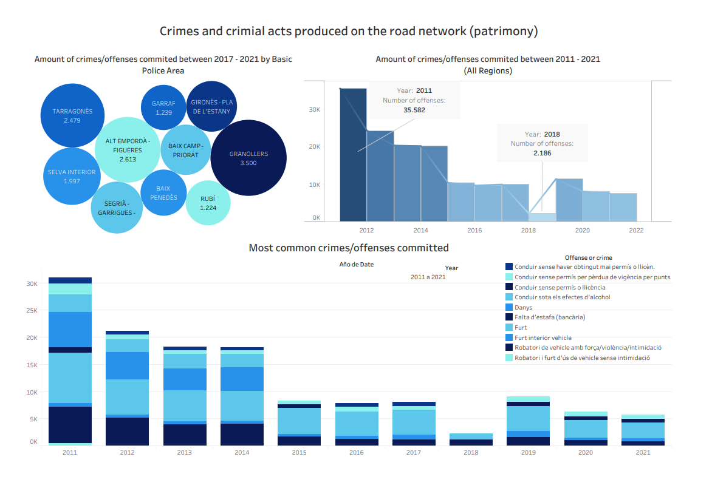

# Crimes and crimial acts produced on the road network (patrimony)
- 📊 Data Visualization Project
- 🗓 Date: May 2022
- 👩🏽‍💻 Created by: Maria Soriano 👋🏼
- 👉🏼  [Check it out here](https://public.tableau.com/views/Crimesandcirminalactsproducedontheroadnetworkpatirmony/Dashboard1?:language=es-ES&:display_count=n&:origin=viz_share_link) 👈🏼

## About
A dashboard displaying information about crimes and criminal acts produced on the road network (patrimony) in Catalonia, Spain. The data has been obtained here.
Note that this data corresponds to only one of the different police forces we have in Spain. The name of the Police Force data displaying here is called Mossos d'Esquadra.
To know more about the competences held by this police force, please check:
Thus, this only reflects part of the reality in reference to crimes produced on the road network. For sure there exists more data registered by other active police forces in Spain, specially Local Police (Policia Local) but it seems like they don't make their data public. If so, I would expand this visualization using both data sources.

## Technologies used:
* Python
* Tableau

## Datasets
- 

Please click the following screenshot to visualize the Tableau dashboard.

Example of visualization
